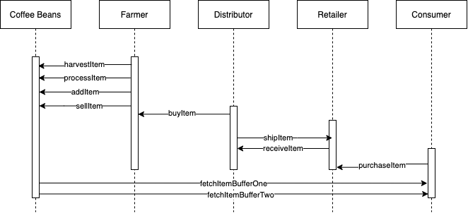

# Version Information
  Rinkeby Location
  ----------------
    https://rinkeby.infura.io/v3/14dc6b8fa59640bcb72d9e43e027f0c3
    wss://rinkeby.infura.io/ws/v3/14dc6b8fa59640bcb72d9e43e027f0c3

    PROJECT ID 14dc6b8fa59640bcb72d9e43e027f0c3

    Contract Address:  0x617089f5EEFE794F4B2078a79bc833c0F1e294E0
    Node Version:  13.10.0
    Truffle Version:  5.1.40
    Web3 Version:  1.2.1

# Requirement 1: Project write up - UML
Activity Diagram
================

Sequence Diagram
================

State Diagram
================

Class Diagram
=============

# Requirement 2: Project write-up - Libraries
I used the Roles library to mangage the different roles with in this DApp.  The roles used in this DApp are Farmer, Distributor, Retailer, and Consumer.

# Requirement 3: Project write-up - IPFS
I did not use IPFS for this project

Starting migrations...
======================
Network name:    'rinkeby'
Network id:      4
Block gas limit: 10000000 (0x989680)

1_initial_migration.js
======================

   Deploying 'Migrations'
   ----------------------
    transaction hash:    0x99d0cefd5a63f98d1ead1ca8ba30b109fe4c81908d694fffad2affe42334288b
    Blocks: 0            Seconds: 8
    contract address:    0x617089f5EEFE794F4B2078a79bc833c0F1e294E0
    block number:        7224897
    block timestamp:     1600529540
    account:             0xeabf1459776380Ff4582Af568b763d01023B0712
    balance:             55.21129558
    gas used:            225237 (0x36fd5)
    gas price:           10 gwei
    value sent:          0 ETH
    total cost:          0.00225237 ETH

    Saving migration to chain.
    Saving artifacts
   -------------------------------------
    Total cost:          0.00225237 ETH

2_deploy_contracts.js
=====================

   Deploying 'FarmerRole'
   ----------------------
    transaction hash:    0x51273f1009f857abfa35f0141544524965b1265227b7f7256ade4fcc4d42563f
    Blocks: 0            Seconds: 5
    contract address:    0x2Db957a9dD922a6a430E3Dd1332CAE5ecaD52ce8
    block number:        7224899
    block timestamp:     1600529570
    account:             0xeabf1459776380Ff4582Af568b763d01023B0712
    balance:             55.20758809
    gas used:            328386 (0x502c2)
    gas price:           10 gwei
    value sent:          0 ETH
    total cost:          0.00328386 ETH

   Deploying 'DistributorRole'
   ---------------------------
    transaction hash:    0xcd5c4a230901042f10e0298522ae4cd4846d28ebfb964c577ed71ded9d1237ce
    Blocks: 0            Seconds: 8
    contract address:    0xE6Bc8Fc0d3aA67Cc9c023864e5C573F739b5D91b
    block number:        7224900
    block timestamp:     1600529585
    account:             0xeabf1459776380Ff4582Af568b763d01023B0712
    balance:             55.20430399
    gas used:            328410 (0x502da)
    gas price:           10 gwei
    value sent:          0 ETH
    total cost:          0.0032841 ETH

   Deploying 'RetailerRole'
   ------------------------
    transaction hash:    0x7e7dd3090cb941b5ef49c235998e05c3668c98a638fbc75525f4edaf44710a8f
    Blocks: 0            Seconds: 8
    contract address:    0x72D78A4471939bd312c44744f75D5BAc2E883e62
    block number:        7224901
    block timestamp:     1600529600
    account:             0xeabf1459776380Ff4582Af568b763d01023B0712
    balance:             55.20101989
    gas used:            328410 (0x502da)
    gas price:           10 gwei
    value sent:          0 ETH
    total cost:          0.0032841 ETH

   Deploying 'ConsumerRole'
   ------------------------
    transaction hash:    0x31c8034608d6e7af9ed274c7fb01cf768c85cdca17b9a963bf7a9cd45cda4fdf
    Blocks: 0            Seconds: 12
    contract address:    0x57B8944C2Cc896E8B05fB925358f7C18e3273e1c
    block number:        7224902
    block timestamp:     1600529615
    account:             0xeabf1459776380Ff4582Af568b763d01023B0712
    balance:             55.19773579
    gas used:            328410 (0x502da)
    gas price:           10 gwei
    value sent:          0 ETH
    total cost:          0.0032841 ETH

   Deploying 'SupplyChain'
   -----------------------
    transaction hash:    0x86a61cbf32258e89ce848b8a7c9decf738bbcd130ab4b1ea60e59314da566b4b
    Blocks: 0            Seconds: 8
    contract address:    0x3Ebb072232c03cA1fc6e4e2CE69717D3Ccd4DDfa
    block number:        7224903
    block timestamp:     1600529630
    account:             0xeabf1459776380Ff4582Af568b763d01023B0712
    balance:             55.16515125
    gas used:            3258454 (0x31b856)
    gas price:           10 gwei
    value sent:          0 ETH
    total cost:          0.03258454 ETH

    Saving migration to chain.
    Saving artifacts
   -------------------------------------
    Total cost:           0.0457207 ETH

   Summary
   -------
     Total deployments:   6
     Final cost:          0.04797307 ETH

Transaction History
-------------------
    Harvested - 0x9eb575f26bdd4735dbfd860605b22cd828b8f324e5def270776a51dcbb2bfec5
    Processed - 0x87e027390bd6051fc576054fd1c41ede3fb107850af3f670c7fa9442196842ef
    Packed - 0xa7c37212687e3cda9d50baf09939183aee6d891f09ea02aacde26a0f0ddf4cf4
    ForSale - 0x53899d96b503488d22cb204829b258e70a0f45e3a02c84263bb18764eac901c2
    Sold - 0x47a2b3156584209819f6761b70fcdf58c743ee60a145fc0b3ec3535177eb3613
    Shipped - 0x1063f95296858e7c04254c9a0d557815955eac267e91d227a6f4e8535e9d2816
    Received - 0xb757c94f2aa605b422d166055090f8f222d12b5aa7674eaa02620b1a04726a0d
    Purchased - 0xbe5424a5f8464993ca7de088e16c4c4807b600a0403672d72bb806419504f679